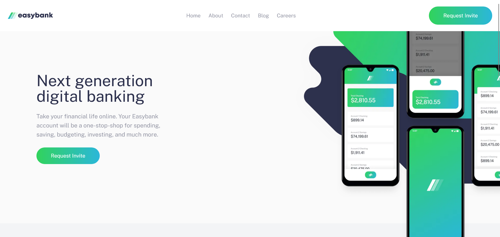

# Frontend Mentor - Easybank landing page solution

This is a solution to the [Easybank landing page challenge on Frontend Mentor](https://www.frontendmentor.io/challenges/easybank-landing-page-WaUhkoDN). Frontend Mentor challenges help you improve your coding skills by building realistic projects.

## Table of contents

- [Frontend Mentor - Easybank landing page solution](#frontend-mentor---easybank-landing-page-solution)
  - [Table of contents](#table-of-contents)
    - [Screenshot](#screenshot)
    - [Links](#links)
  - [Author](#author)

### Screenshot

### Links

- Live Site URL: [julian-easybank.vercel.app](https://julian-easybank.vercel.app/)

## Author

- Frontend Mentor - [@piaseckijulian](https://www.frontendmentor.io/profile/piaseckijulian)
- Twitter - [@piaseckijulian](https://www.twitter.com/piaseckijulian)
